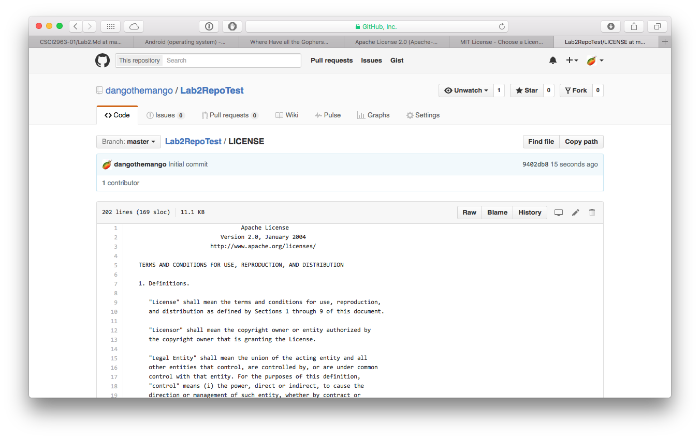

2. It is important to choose a license so you can control who has access to your code and how much access they have. Without a license you restrict everyone from your code and only you can help it grow and develop. with a licencse others can help you grow your software, and you can even choose whether or not those growths can get back to you

3. A project without an explicit license is "All Rights Reserved." This is not an open source license and others have no rights to use, edit, or distribute this code. If you use this code, you are liable to be sued.

4. I agree with both conclusions outlined in this document. My first thought while reading the introduction was that Gopher probably died out because of technological limitations, but when i learned that HTTP was open source, i changed my mind. Something as big of the internet could not possibly be restricted to a non-open source scope. There is no way that it could ever hae become what it is now.

5. Android uses GPLv2 for a few reasons, the first is that many manufacturers can create Android phones. Android needs to ensure that their software is compatible. Second, since GPLv2 requires "copyleft" Android can continue to maintain and certify their software. Third, since the software allows customization and is avaliable on many different devices, it can effectively compete with apple

6. I would choose an MIT License, this is because I am a student and would love to see my code get out there and I never plan on monetizing it.

7. Apache is the best for the common good because it allows the most freedom and therefore the most options for use. GPL would be a good choice for a company because it ensures that they always have access to the latest most capable version of the software and that they maintain control of it. As a developer I would prefer an Apache license because I want more people to be able to see my code and make it better.

8. 

9.
Website | License Present | License
---------|:----------|:-------
https://github.com/rcos/Observatory | Yes | Two Clause BSD License https://en.wikipedia.org/wiki/ISC_license
https://github.com/CloudBench-IDE/cloudbench | Yes | Apache 2.0
https://github.com/wtg/shuttle_tracking_2 | NO | NA
https://github.com/bocaaust/CrowdCop/blob/master/LICENSE.md | Yes | Apache 2.0
https://github.com/RCOS-Grading-Server/HWserver | Yes | BSD
https://github.com/Stashmatic/ARAS | Yes | MIT

10. Assuming i do a project using the pebble, possible changing the firmware to make something cooler, I will have to include a GPL license with link exception becuse that is one of the restrictions of the open source license currently existing on the software

 This work is licensed under a http://creativecommons.org/licenses/by/4.0/ Creative Commons Attribution 4.0 International License.

